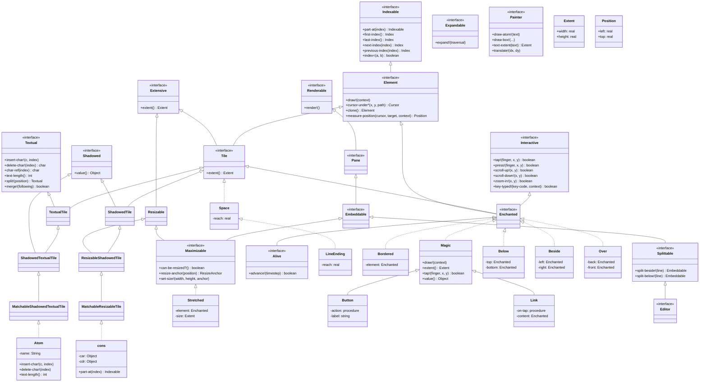

# GRASP Class Diagram (Iteration 4)

Based on code analysis of `src/` directory.
Generated by Claude.

## Key Hierarchies

### Core Element Hierarchy
- `Indexable` - provides navigation through structure
- `Element` - base for all drawable elements
- `Tile` - elements with extent (size)

### Trait Composition
- `ShadowedTile` = `Tile` + `Shadowed` (has value representation)
- `TextualTile` = `Tile` + `Textual` (editable text)
- `ShadowedTextualTile` = `Tile` + `Shadowed` + `Textual`
- `MatchableShadowedTextualTile` = above + pattern matching

### Extension System
- `Enchanted` = `Interactive` + `Tile` + `Element` - base for all extensions
- `Magic` - default implementation of `Enchanted`
- `Alive` - animated extensions

### Primitive Types
- `Atom` - text element (implements `MatchableShadowedTextualTile`)
- `cons` - pair/list element (implements `MatchableResizableTile`)
- `Space` - whitespace
- `LineEnding` - line break

### Combinators
- `Bordered` - adds border around element
- `Below`, `Beside`, `Over` - layout combinators
- `Stretched` - resizable wrapper

### UI System
- `Pane` → `Embeddable` → `Splittable` → `Editor`
- `Maximizable` - full-screen capable widgets
